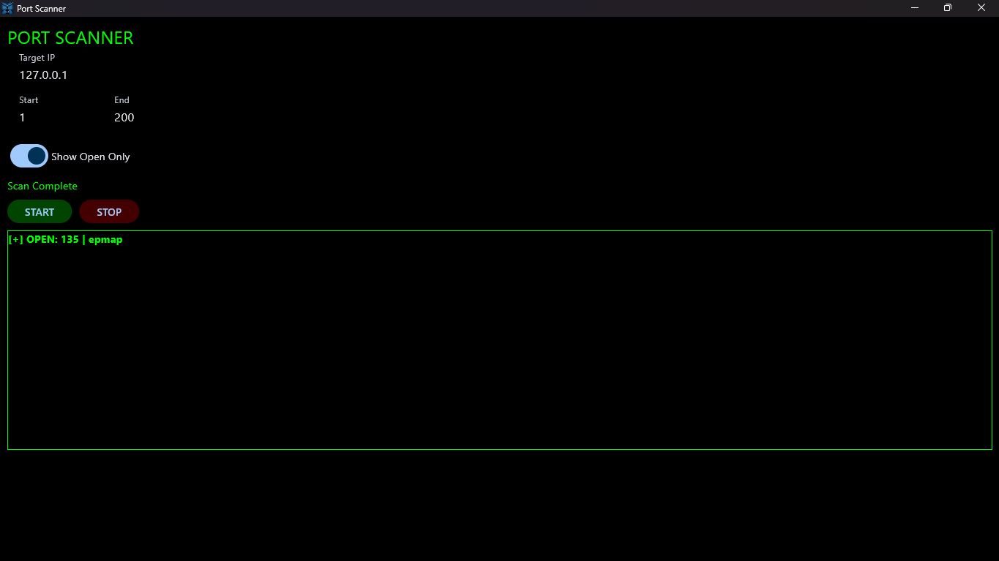

# ⚡ Port Scanner

A lightweight, high-performance cross-platform network port scanner built with **Python 🐍**, **Flet 📱**, and **ThreadPoolExecutor 🧵**. Features a sleek, hacker-inspired terminal UI with real-time status updates and multi-threaded concurrency.



## 🚀 Features

* **Multi-Threaded Scanning ⚡:** Powered by a `ThreadPoolExecutor` pool (default 200 workers) for ultra-fast port evaluation and network testing.
* **Real-Time UI Updates 🔄:** Thread-safe state management ensuring smooth performance without race conditions, lag, or UI crashes.
* **Smart Filtering 🔍:** Instant toggle to switch between viewing all scanned logs or narrowing down results exclusively to active open ports.
* **Design 💻:** Designed with a dark terminal theme, neon green highlights, and custom Windows branding for an immersive cybersecurity tool experience.

---

## 🛠️ Tech Stack

* **Language 🐍:** Python 3.14+
* **UI Framework 📱:** [Flet](https://flet.dev/) (v0.86.1+)
* **Concurrency 🧵:** `concurrent.futures`, `threading`

---

## 💻 Getting Started

### Prerequisites

Make sure you have Python 3.14+ installed on your system along with your preferred code editor 📝.

### Quick Setup

1. Open your project directory directly in VS Code 📂:
```text
C:\Projects\PortScanner

```


2. Point VS Code to your active Python 🐍 environment or create a virtual environment 📦, then install the required dependencies:
```bash
pip install flet

```


3. Run the application 🚀:
```bash
python main.py

```


---

## ⚙️ Usage

1. Enter the target IP address or hostname 🌐 in the input field.
2. Define your target port range (`Port Start` and `Port End` 🔢).
3. Click **START** to initiate the multi-threaded network scan.
4. Toggle the filter switch to narrow down results to active open ports only or all closed/open ports.

---

## ⬇️ Release

1. For [Windows](https://github.com/tusharaggarwal2007/Port-Scanner/releases/download/v1.0.0/PortScanner.exe) (v1.0.0-pre-release)
2. For Android(soon)
3. For MacOs(soon)
